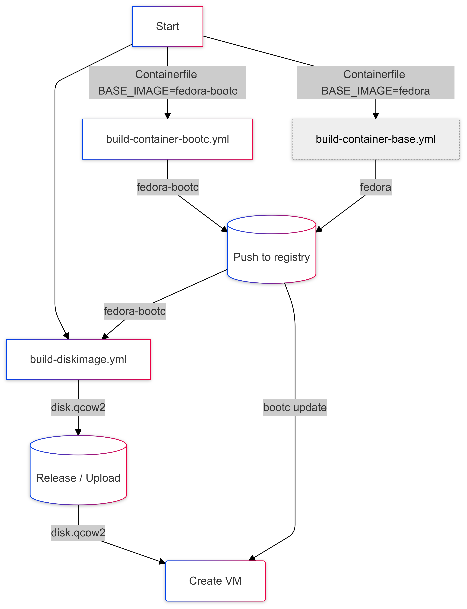

Fedora (Bootable) Containers example
====================================

"From `Containerfile` to Virtual Machine"


## Summary

This repository contains the material used for the presentation "From `Containerfile` to Virtual Machine". It describes the use of [bootc](https://containers.github.io/bootc/), which uses a `Containerfile` to create a container and converts this to a virtual machine.


## Presentation

The source of the presentation is available in the `presentation` directory. The presentation is written in Markdown (revealjs) and uses Obsidian's Extended Slides plugin.

An export is available at [https://gbraad-redhat.github.io/fedora-bootc-example/](https://gbraad-redhat.github.io/fedora-bootc-example/)


## Containers

The `container` directory contains the `Containerfile`, which is build using the workflow scripts in `.github/workflows`.

Runs of these actions can be found at [https://github.com/gbraad-redhat/fedora-bootc-example/actions](https://github.com/gbraad-redhat/fedora-bootc-example/actions)

Successful builds are available at [https://github.com/orgs/gbraad-redhat/packages?repo_name=fedora-bootc-example](https://github.com/orgs/gbraad-redhat/packages?repo_name=fedora-bootc-example).


## Disk image

The latest disk image is available at [https://github.com/gbraad-redhat/fedora-bootc-example/releases/tag/latest](https://github.com/gbraad-redhat/fedora-bootc-example/releases/tag/latest), which is purposely a release behind the container builds. Therefore you can use `sudo bootc update` to update the disk image to the latest version.

This file is named `disk.qcow2` and can be run with:

```shell
$ sudo virt-install \
    --name fedora-bootc \
    --cpu host \
    --vcpus 2 \
    --memory 2048 \
    --import --disk disk.qcow2 \
    --os-variant fedora-eln
```

After the machine came up, you can log in using:

```shell
$ ssh admin@<ip>
```

> [!NOTE]
> The password is `password`.


## Release flow



The bootc-based container images are pushed to a 'public' registry, while the disk image is released as a GitHub release.
After an update to the container image, you push to the registry and update the running VM using `bootc update`.


Authors
-------

| [](http://gbraad.nl "Gerard Braad <me@gbraad.nl>") |
|---|
| [@gbraad](https://gbraad.nl/social)  |
